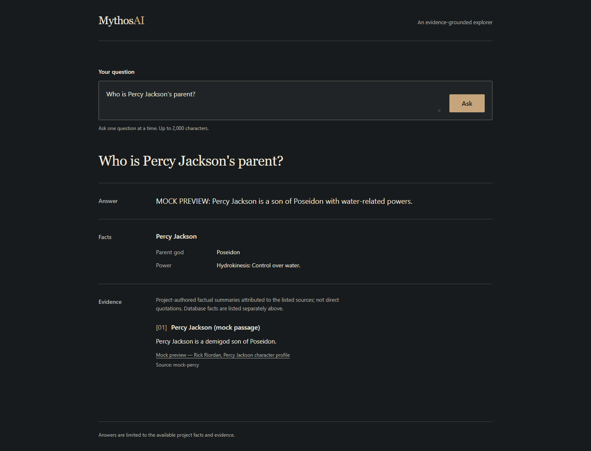
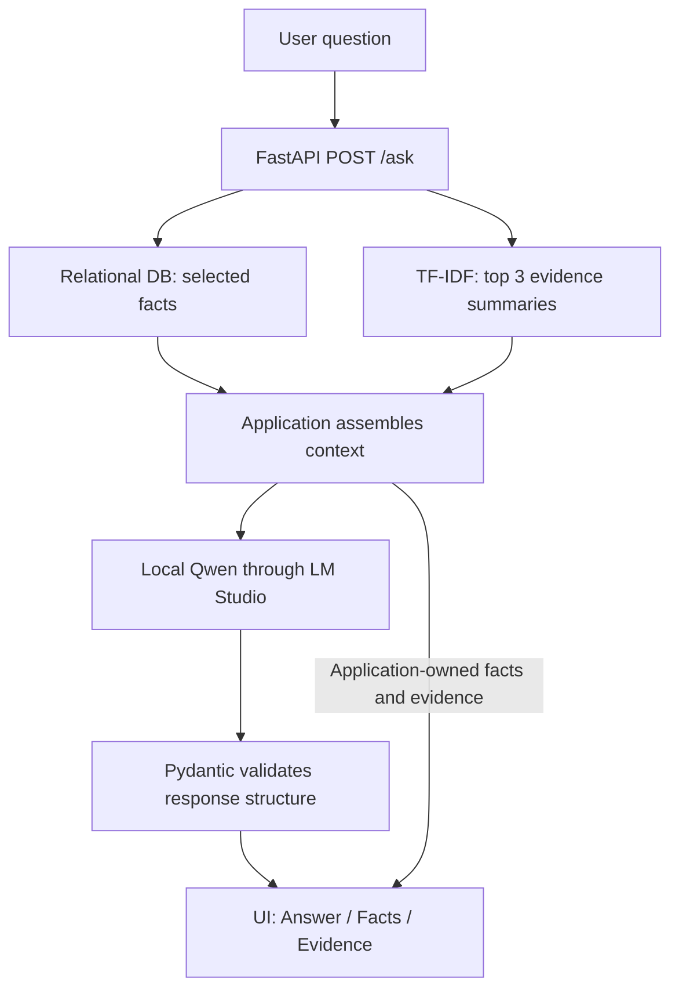

# MythosAI

An evidence-grounded explorer for the Percy Jackson universe. Ask a question and inspect the generated answer alongside the relational database facts and attributed evidence summaries supplied to a local Qwen model. Built with FastAPI, SQLAlchemy, a small lexical retriever, and a vanilla HTML/CSS/JavaScript frontend.



*Production result interface shown with deterministic preview data. The preview uses the real response schema; no live model inference is shown.*

## What it does

1. Matches named characters and gods to selected database profiles.
2. Retrieves up to three relevant passages from 12 project-authored summaries attributed to six official Rick Riordan pages.
3. Sends the question and both forms of context to Qwen through LM Studio.
4. Validates the generated response structure and displays **Answer**, **Facts**, and **Evidence** separately, with source links.

If neither context source returns anything, the application reports insufficient context without calling the model. When context exists, the model is instructed to decline questions it cannot answer from that context.

## Architecture and grounding



The grounding design combines three deliberately small components:

- **Relational facts:** deterministic name matching selects character/god profiles from MySQL or MariaDB. The model does not generate or execute SQL.
- **Attributed evidence:** TF-IDF cosine similarity ranks a local JSON corpus. These are original factual paraphrases of listed sources, not quotations or independent verification of database facts. Retrieval scores measure lexical similarity, not confidence.
- **Local generation:** `httpx` calls LM Studio's OpenAI-compatible `/v1/chat/completions` endpoint with JSON-schema response formatting. The model returns only `answer` and `insufficient_context`; the application supplies facts and evidence unchanged.

Pydantic validates response structure, **not factual correctness**. Invalid model output produces an error rather than a fabricated answer. See the [current architecture](docs/ARCHITECTURE.md) and [corpus documentation](corpus/README.md).

## Offline evaluation

The [18 fixed cases](evaluation/cases.json) cover direct questions, paraphrases, complementary database/evidence context, and unsupported questions. The evaluator uses an isolated SQLite fixture and the existing context-selection code. It makes no live inference requests.

| Deterministic check | Passed / checked |
|---|---:|
| All applicable checks per case | 17 / 18 |
| Expected evidence in top 3 | 13 / 14 |
| Exact selected entities | 18 / 18 |
| Expected database facts | 6 / 6 |
| Expected empty-context gate outcome | 17 / 18 |

**Case 08 fails:** “Which hero can stay submerged without needing air?” returns no context despite the corpus describing Percy's underwater breathing. The wording exposes the lexical retriever's semantic-paraphrase limitation. The failure remains in the benchmark.

These counts are **not model accuracy**. Generated answer quality and refusals for unsupported questions with related context are not evaluated. [Raw results](evaluation/results.json) include expectations, selected facts, retrieved source IDs, and corpus/case hashes.

Run from a configured environment:

```powershell
python -m scripts.evaluate
```

The current benchmark exits **1** because Case 08 fails. It needs no running database or LM Studio server; settings still require `DB_USER` and `DB_NAME`.

## Stack

Python 3.13 · FastAPI · SQLAlchemy/PyMySQL · MySQL/MariaDB · Pydantic · httpx · LM Studio/Qwen · vanilla HTML/CSS/JavaScript. Tests and evaluation use SQLite; retrieval uses no embeddings or vector database. FastAPI serves both the UI and API.

## Run locally

Follow the [local setup guide](docs/LOCAL_SETUP.md) for dependencies and the verified database initialization sequence. Copy [`.env.example`](.env.example) to `.env` for a new checkout and configure your database credentials.

In LM Studio, load **Qwen3 4B Instruct 2507** (the verified local setup uses Q4_K_M) and start its local server. The application defaults are:

```dotenv
LM_STUDIO_BASE_URL=http://127.0.0.1:1234
LM_STUDIO_MODEL=qwen/qwen3-4b-2507
LM_STUDIO_TIMEOUT_SECONDS=120
```

No OpenAI API key or paid cloud API is required. With the database and model server running:

```powershell
.\venv\Scripts\python.exe -m uvicorn api.main:app --host 127.0.0.1 --port 8000
```

Open `http://127.0.0.1:8000/` for Ask or `http://127.0.0.1:8000/docs` for the API. Local generation can take around a minute or longer on the tested machine; requests can time out.

## Tests and CI

With project dependencies installed and `DB_USER`/`DB_NAME` configured:

```powershell
python -m pytest
node --test tests/frontend/app.test.mjs
python -m ruff check .
python -m ruff format --check .
```

Backend tests use isolated SQLite databases and mocked inference. Node tests need no npm installation. [GitHub Actions](.github/workflows/ci.yml) runs Ruff, pytest, and frontend tests with Python 3.13 and Node 22 on pushes and pull requests targeting `dev` and `main`. It does not run live model inference.

## Limits and next steps

- Twelve summaries provide narrow coverage; neither evidence nor database profiles form an authoritative or exhaustive reference.
- Lexical retrieval misses some paraphrases, and database matching is limited to named character/god profiles.
- Related context does not guarantee answerability; schema validation cannot establish that an answer is true.
- Local inference is slow on the tested hardware. This is a local portfolio MVP, without authentication or a public deployment.

Potential follow-up work is limited to measuring whether semantic retrieval improves the known paraphrase failure and investigating faster local inference.

## Background

MythosAI evolved from a university Database Systems project into this evidence-grounded portfolio application. The original relational schema remains its foundation.

AI tools assisted implementation, debugging, and documentation. Architecture, scope, engineering decisions, review, and testing were human-owned. Earlier speculative roadmaps are retained as historical planning documents, not descriptions of implemented features.
